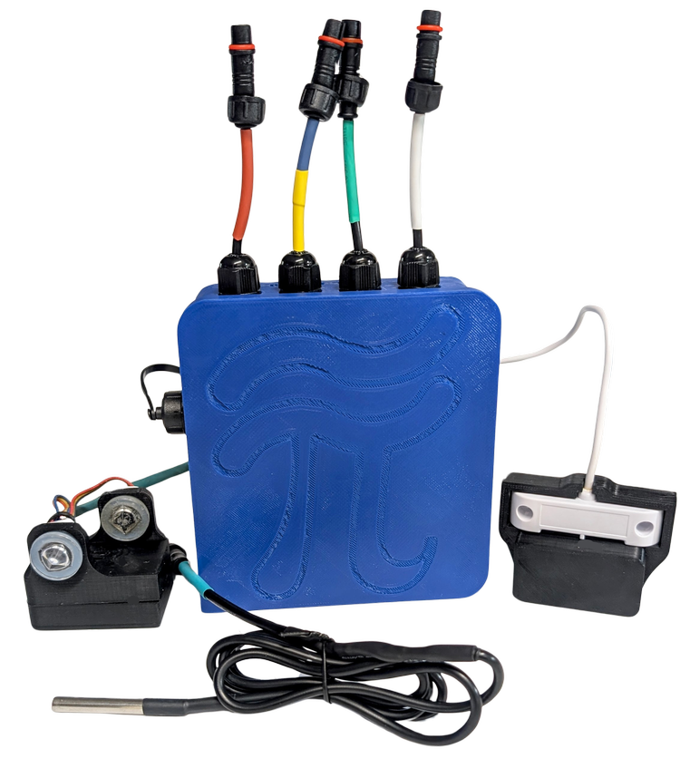

# [AquaPi for ESPHome](./)

The Aquarium meets the Smart Home! AquaPi brings powerful monitoring and automation to your aquarium setup using affordable [ESPHome](https://esphome.io/) devices and [Home Assistant](https://www.home-assistant.io/).  

**Open-source:** Freely accessible for anyone to use, modify, and contribute.  
**Modular and Customizable:** Expand the system to fit your specific needs and preferences.  
**Affordable:** A budget-friendly alternative to high-end monitoring solutions without compromising functionality.  
**Versatile:** Monitor and automate a wide range of vital water parameters such as pH, salinity, dissolved oxygen, and more.  

---

### **Quick Links**
- **[Setup Guide](https://github.com/TheRealFalseReality/aquapi/wiki/Setup-AquaPi):** Start here for step-by-step instructions.
- **[Build It Yourself](https://github.com/TheRealFalseReality/aquapi/wiki/Build-It-Yourself):** Parts list and assembly guide.
- **[In-Depth Wiki](https://github.com/TheRealFalseReality/aquapi/wiki):** Calibration, sensor info, circuit diagrams, and more.
- **[Join the Discussion!](https://www.reef2reef.com/threads/aquapi-an-open-souce-aquarium-controller.1033171/)** Participate in the Reef2Reef forums!
- **[Buy AquaPi Now!](https://www.capitalcityaquatics.com/store/aquapi)** Purchase complete builds or modular components.

---

## Why AquaPi?

---

## Demo
[**Try out the AquaPi Demo!**](https://www.capitalcityaquatics.com/store#storelivedemo)

<table>
  <tr>
    <td>
      
    </td>
    <td>
      
    </td>
  </tr>
</table>

---

## Key Features

- Comprehensive monitoring for **temperature**, **pH**, **salinity**, **dissolved oxygen**, and more using affordable Atlas Scientific EZO circuits.
- Seamless integration with **ESPHome** and **Home Assistant** for robust automation, visualization, and control.
- Expandable system to add new sensors, actuators, and custom automations tailored to your aquarium.

---

## Hardware Requirements

- **ESP32 DevKit:** A versatile microcontroller to power AquaPi.
- **Home Assistant Device:** A Raspberry Pi 3 or higher is recommended (the more RAM, the better).
  - Setup Home Assistant on your Raspberry Pi: [Get Raspberry Pi Imager](https://www.raspberrypi.com/software/)
- **Power Supply:** A reliable 5V 3A power source.

### Supported Sensors and Probes
#### **Temperature (Dallas DS18B20):**
- Waterproof thermistor capable of supporting multiple probes using an index-based configuration.
- [**Temperature Sensor Wiki**](https://github.com/TheRealFalseReality/aquapi/wiki/Dallas-Temperature-Sensor)

#### **Water Level:**
- Optical infrared liquid sensors with magnetic mounts.

#### **Water Leak Sensor:**
- Detects leaks with liquid detection sensors and magnetic mounting for flexibility.

#### **pH Monitoring (EZO-pH):**
- High-accuracy pH measurements with the EZO pH circuit, ISO 10523 compliant.  
- **Range:** 0-14 pH  
- **Recalibration Interval:** 1 year  
- **Probe Life Expectancy:** ~2.5+ years  
- [**pH Datasheet**](https://files.atlas-scientific.com/pH_EZO_Datasheet.pdf)

#### **Salinity Conductivity (EZO-EC):**
- Measures conductivity, TDS, salinity, and specific gravity with EZO EC circuit, ISO 7888 compliant.  
- **Range:** 0.07−500,000+ μS/cm  
- **Recalibration Interval:** ~10 years  
- **Probe Life Expectancy:** ~10 years  
- [**EC Datasheet**](https://files.atlas-scientific.com/EC_EZO_Datasheet.pdf)

#### **Dissolved Oxygen Monitoring (EZO-DO):**
- Accurate dissolved oxygen monitoring, suitable for many environments.  
- **Range:** 0.00-100 mg/L (0-350% saturation)  
- **Probe Life Expectancy:** ~4 years  
- [**DO Datasheet**](https://files.atlas-scientific.com/DO_EZO_Datasheet.pdf)

#### **Oxidation-Reduction Potential (EZO-ORP):**
- Measures the oxidation or reduction potential state in water.  
- **Range:** -2000mV to +2000mV  
- **Probe Life Expectancy:** ~2 years  
- [**ORP Datasheet**](https://files.atlas-scientific.com/ORP_EZO_Datasheet.pdf)

#### **Peristaltic Dosing Pump (EZO-PMP):**
- Dispenses liquids accurately for chemical or nutrient dosing.  
- **Flow Rate:** 0.5ml to 105ml/min  
- **Tube Size:** 5mm  
- **Head Height:** 8.1m (26.5')  
- [**Peristaltic Pump Datasheet**](https://files.atlas-scientific.com/EZO_PMP_Datasheet.pdf)

#### **Carbon Dioxide Air Monitoring (EZO-CO2):**
- Measures gaseous CO2 concentration.  
- **Range:** 0−10,000 ppm  
- **Life Expectancy:** ~5.5 years  
- [**CO2 Datasheet**](https://files.atlas-scientific.com/EZO_CO2_Datasheet.pdf)

### Additional Supported Sensors
- **Humidity:** [EZO-HUM Datasheet](https://files.atlas-scientific.com/EZO-HUM-Datasheet.pdf)  
- **RTD Temperature:** [EZO-RTD Datasheet](https://files.atlas-scientific.com/EZO_RTD_Datasheet.pdf)

### Circuit Diagram
For a detailed circuit diagram and wiring instructions, visit the [Wiki Circuit Page](https://github.com/TheRealFalseReality/aquapi/wiki/Circuit).

---

## Installation and Setup
### Setup Your Devices:
Follow the **[Setup Guide](https://github.com/TheRealFalseReality/aquapi/wiki/Setup-AquaPi)** for detailed step-by-step instructions for configuring your ESP32, connecting your sensors, and running AquaPi.

### Update Wirelessly:
Keep your AquaPi firmware up-to-date with **ESPHome** using the built-in Over-the-Air (OTA) update functionality. For details, see the [Update Guide](https://github.com/TheRealFalseReality/aquapi/wiki/Setup-AquaPi#update).

### Web Server Access:
Optionally, you can access AquaPi's web server for managing the device without Home Assistant. See the [Web Server Guide](https://github.com/TheRealFalseReality/aquapi/wiki/Setup-AquaPi#update) for more details.

---

## Expand and Customize AquaPi
AquaPi's modular design can be customized and expanded to meet your specific needs. For advanced configurations, see:  
- **[Blueprints](https://github.com/TheRealFalseReality/aquapi/wiki/Blueprints):** Automations to control other smart devices in Home Assistant.  
- **[Substitutions](https://github.com/TheRealFalseReality/aquapi/wiki/Substitutions):** Custom configuration variables for your specific setup.

---

## AquaPi AI: Your Intelligent Aquarium Assistant 🐠
### **[AquaPi AI](https://therealfalsereality.github.io/):** Level up your aquarium with AI!  
- **AI Compatibility Calculator:** Check fish compatibility instantly.  
- **Care Guides & Recommendations:** Get expert tank advice.  
- **Automation Scripts & Photo Analysis:** Automate your aquarium and analyze photos for optimized care.  

---

## Get Started Today!
- Check out the **[Setup Guide](https://github.com/TheRealFalseReality/aquapi/wiki/Setup-AquaPi)** to start using AquaPi.
- Enhance your aquarium monitoring with AquaPi’s powerful open-source, modular system!

---

